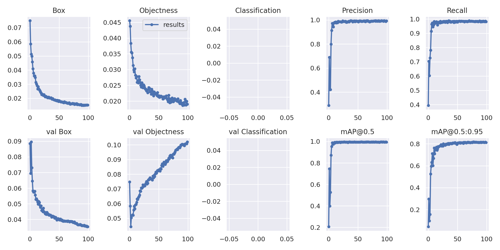
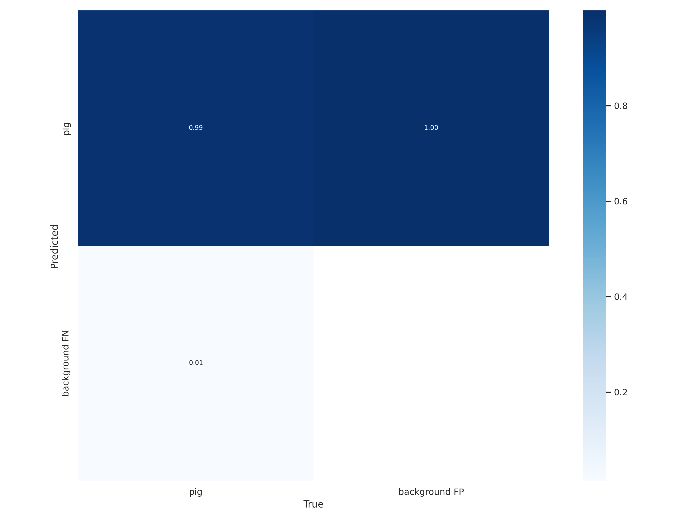
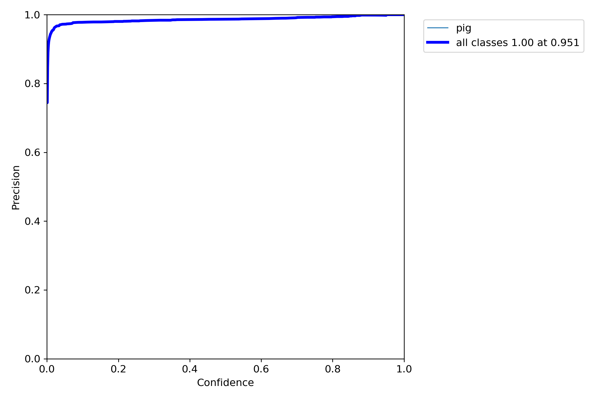
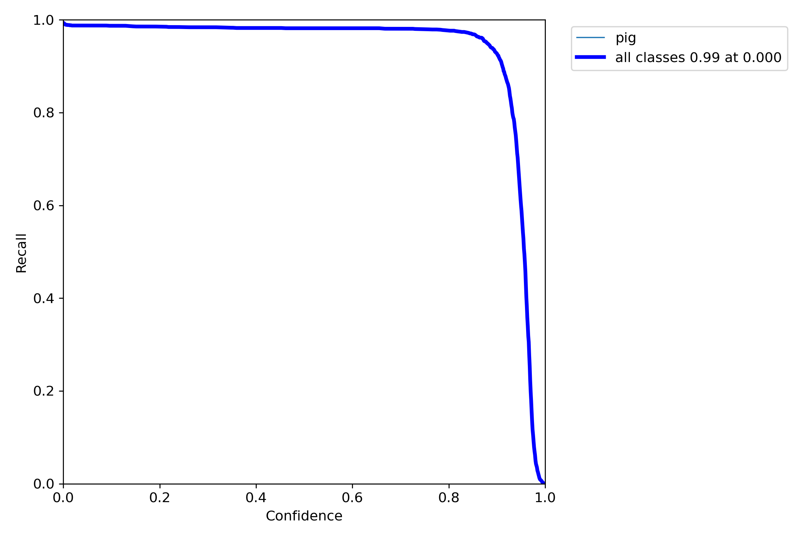
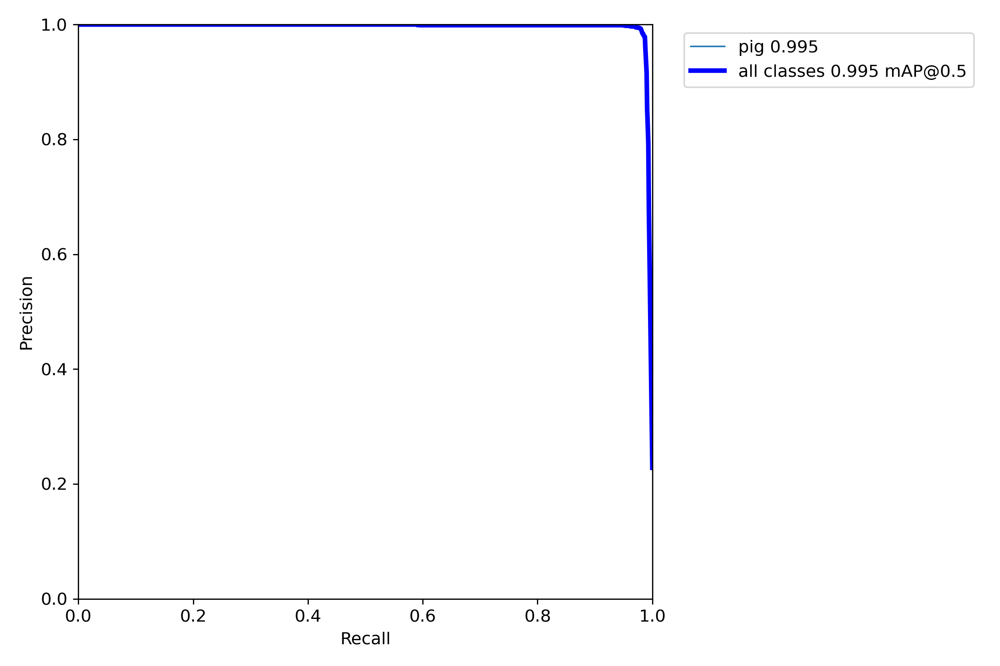
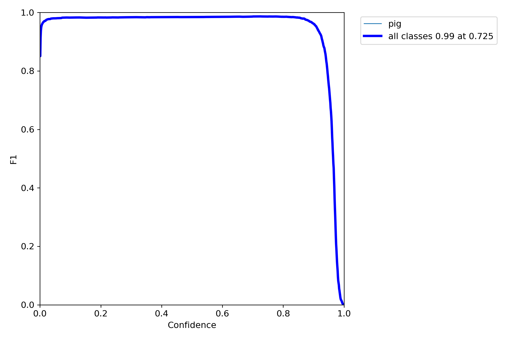
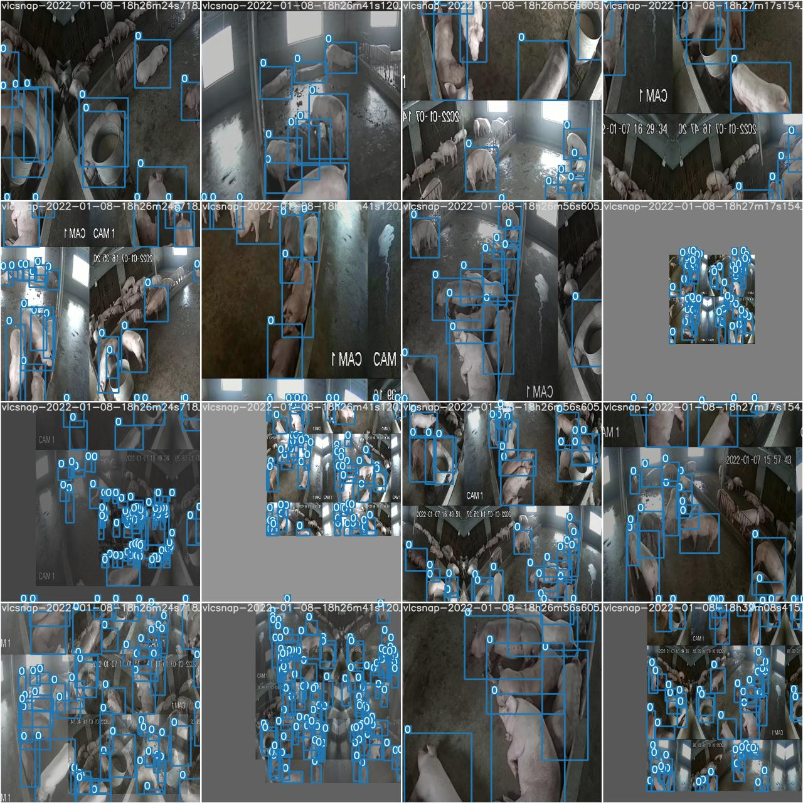
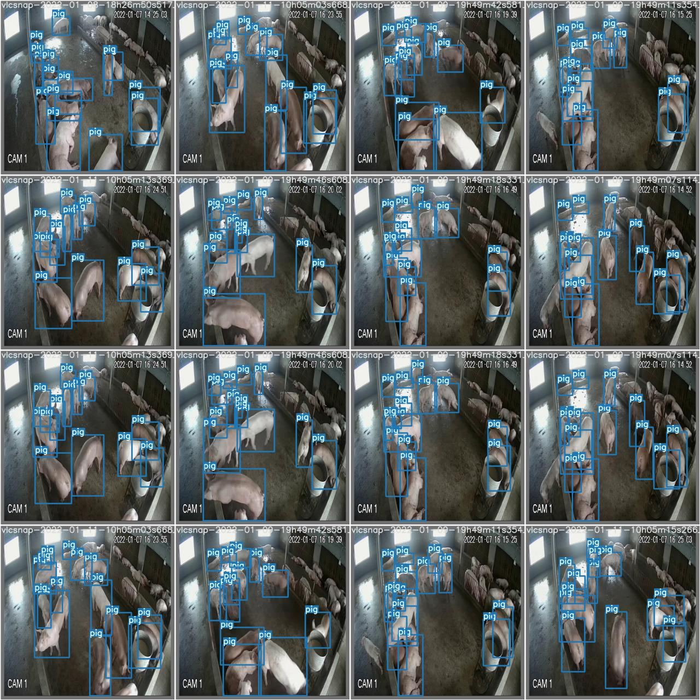
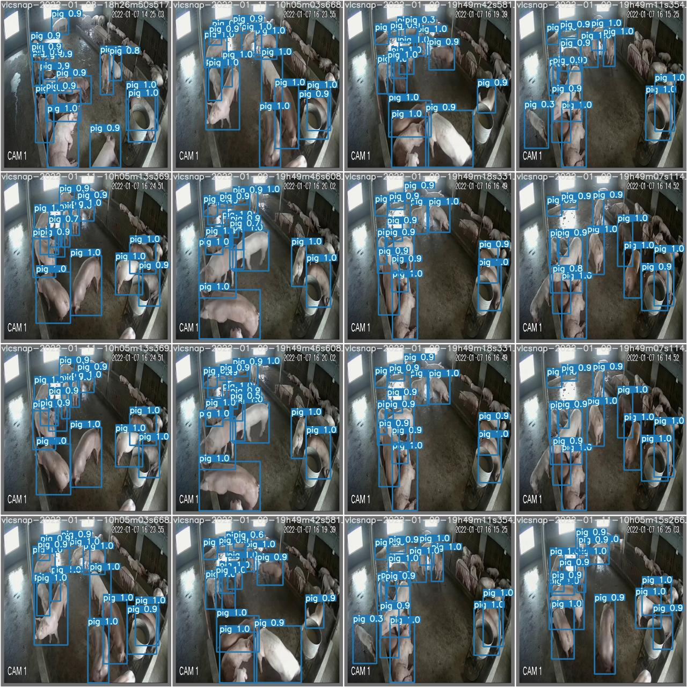

# 基于YOLOv7的猪只目标识别模型技术文档

本文档详细介绍了使用 YOLOv7 算法和 Roboflow 猪只数据集进行目标检测模型训练、评估和部署的全过程。

---

## 1. 项目概述

本项目旨在训练一个能够准确识别图像和视频中猪只的高性能目标检测模型。我们选用在速度和精度上均表现出色的 YOLOv7 算法，并利用 Roboflow 平台获取并格式化了猪只数据集。

### 1.1 技术栈

- **模型算法**：YOLOv7
- **深度学习框架**：PyTorch
- **数据集平台**：Roboflow
- **核心编程语言**：Python

### 1.2 硬件与环境建议

- **系统**：Linux（Ubuntu 18.04 或更高版本）/  windows
- **GPU**：NVIDIA GPU（推荐 V100、RTX 30 系列、A100 等），显存不低于 16GB/  cpu
- **软件依赖**：
  - CUDA 11.x
  - cuDNN 8.x
  - Python 3.8+
  - Git

---

## 2. 环境搭建与项目准备

### 2.1 克隆 YOLOv7 官方代码库

首先，从 GitHub 克隆 YOLOv7 的官方代码库，这是我们所有工作的基础：

```bash
git clone https://github.com/WongKinYiu/yolov7.git
cd yolov7
```

### 2.2 创建并激活 Python 虚拟环境

为了保持项目依赖的隔离，强烈建议使用 Conda 或 venv 创建虚拟环境：

```bash
conda create -n yolov7-pigs python=3.8 -y
conda activate yolov7-pigs
```

### 2.3 安装所需的依赖包

YOLOv7 项目提供了一个 `requirements.txt` 文件，包含了所有必需的 Python 库：

```bash
pip install -r requirements.txt
```

> **注意**：请确保你的 PyTorch 版本与你的 CUDA 版本相匹配。如果安装缓慢或出错，可以考虑使用国内镜像源。

---

## 3. 数据集准备

本项目使用的数据集来自于 Roboflow，它是一个强大的数据集管理和增强工具。

### 3.1 从 Roboflow 获取数据集

1. **访问 Roboflow**：前往 Roboflow 官网并搜索 “Pig” 相关的公开数据集。
2. **选择并下载**：找到一个合适的猪只数据集。在导出（Export）时，选择 “YOLOv7 PyTorch” 格式。
3. **直接通过我的网盘下载**：
   > **通过网盘分享的文件：pig**
   >
   > 链接: https://pan.baidu.com/s/17SQh6gXG9yGZMC2aTMkswA?pwd=ijcu  提取码: ijcu
   >
   > 该网盘内包含数据集 pig 压缩包。

4. **数据集结构**：下载后会得到一个压缩包，解压后目录结构如下：

```
数据集根目录/
├── train/
│   ├── images/
│   └── labels/
├── valid/ 或 val/
│   ├── images/
│   └── labels/
├── test/（可选）
│   ├── images/
│   └── labels/
└── data.yaml
```

- `images/`：存放图片文件
- `labels/`：存放标签文件（YOLO 格式）
- `data.yaml`：数据集配置文件

4. **解压数据集**：下载后，将数据集解压到你的项目目录中，例如 `yolov7/data/` 路径下。

### 3.2 data.yaml 配置文件

Roboflow 会自动为你生成一个 `data.yaml` 文件，这是连接你的数据集和 YOLOv7 训练脚本的关键。请检查并确保其内容正确，示例如下：

```yaml
# train and val data as 1) directory: path/to/images/, 2) file: path/to/images.txt, or 3) list: [path/to/image1.jpg, path/to/image2.jpg, ...]
train: ../data/pigs_dataset/train/images
val: ../data/pigs_dataset/valid/images

# number of classes
nc: 1

# class names
names: ['pig']
```

**重要参数说明：**

- `train`：训练集图片的路径。
- `val`：验证集图片的路径。
- `nc`：数据集中的类别总数。对于本项目，只有 “pig” 一个类别，所以是 1。
- `names`：按顺序排列的类别名称列表。

将此文件保存到 `yolov7/data/` 目录下，例如命名为 `pig_data.yaml`。

---

## 4. 模型训练

### 4.1 下载预训练权重

为了加快收敛速度并提升模型性能，我们使用官方提供的预训练权重作为起点：

```bash
cd yolov7
wget https://github.com/WongKinYiu/yolov7/releases/download/v0.1/yolov7.pt
```

这会下载一个在 COCO 数据集上预训练好的模型权重 `yolov7.pt`。

### 4.2. 训练代码

YOLOv7的训练通过train.py脚本来执行。你需要指定几个关键参数。

训练命令示例:

```bash
python train.py \
--weights yolov7.pt \
--data data/pig_data.yaml \
--cfg cfg/training/yolov7.yaml \
--img-size 640 \
--batch-size 16 \
--epochs 100 \
--device 0 \
--name yolov7_pigs_run \
--hyp data/hyp.scratch.p5.yaml
```

#### 参数详解

- `--weights`：初始权重文件路径。
- `--data`：你的数据集配置文件（.yaml）的路径。
- `--cfg`：模型的配置文件，定义了模型的结构。`yolov7.yaml` 是标准 YOLOv7 的配置。
- `--img-size`：输入网络图像的尺寸，通常是 32 的倍数，如 640。
- `--batch-size`：每批次送入 GPU 的图片数量。根据你的 GPU 显存大小进行调整。
- `--epochs`：训练的总轮数。
- `--device`：使用的 GPU 设备编号，0 代表第一块 GPU。如果用 CPU 训练，则指定 `cpu`。
- `--name`：本次训练的实验名称。所有结果将保存在 `runs/train/yolov7_pigs_run` 目录下。
- `--hyp`：超参数文件路径，用于调整学习率、数据增强等。

训练过程开始后，你会在终端看到每个 epoch 的进度，包括损失函数值和评估指标（mAP）。

### 4.3 训练结果与模型文件

训练完成后，所有相关文件都会保存在 `runs/train/yolov7_pigs_run/` 目录下：

- **模型（weights/）：**
  - `best.pt`：在验证集上达到最佳 mAP 的模型权重。这是你后续评估和推理时应该使用的模型。
  - `last.pt`：最后一个 epoch 完成后的模型权重。
- **折线图与曲率图（results.png，results.csv）：**
  - `results.png`：一张包含多种性能曲线的图表，直观展示了训练过程。
    - Box Loss、Objectness Loss、Classification Loss：各项损失函数随 epoch 下降的情况。
    - Precision（精确率）& Recall（召回率）：模型性能指标随 epoch 的变化。
    - mAP@0.5 & mAP@0.5:0.95：平均精度均值，是评估目标检测模型性能的核心指标。
  - `results.csv`：包含了生成上述图表的原始数据，你可以用 Excel 或 Python 库（如 Pandas、Matplotlib）进行更详细的分析和绘图。
- **典型训练过程可视化：**

  
  > **说明：**由于本项目为单类别检测任务，Classification Loss（分类损失）在训练过程中始终为0或无值，这是YOLOv7在单类别下的正常表现。

- **混淆矩阵与各类曲线：**

  | 混淆矩阵 | P 曲线 | R 曲线 | PR 曲线 | F1 曲线 |
  | :------: | :----: | :----: | :-----: | :-----: |
  |  |  |  |  |  |

- **部分训练/测试样本可视化：**

  | 训练样本 | 测试标签 | 测试预测 |
  | :------: | :------: | :------: |
  |  |  |  |

---

## 5. 模型评估

评估阶段使用验证集或测试集来检验 `best.pt` 模型的最终性能，不进行反向传播更新权重。
**可以用已经训练好的模型评估比较**：
   > **通过网盘分享的文件：pig**
   >
   > 链接: https://pan.baidu.com/s/17SQh6gXG9yGZMC2aTMkswA?pwd=ijcu  提取码: ijcu
   >
   > 该网盘内包含模型文件mod压缩包。
### 5.1 评估代码

使用 `test.py` 脚本进行评估：

```bash
python test.py \
  --weights runs/train/yolov7_pigs_run/weights/best.pt \
  --data data/pig_data.yaml \
  --task val \
  --img-size 640 \
  --device 0
```

#### 参数说明

- `--weights`：指向你训练好的最佳模型权重。
- `--data`：仍然是你的数据集配置文件。
- `--task`：指定任务是 `val`（验证）还是 `test`（测试）。
- `--img-size`：评估时使用的图像尺寸，应与训练时一致。

评估完成后，终端会打印出非常详细的指标，包括在 val 或 test 集上的 mAP、Precision、Recall 等。结果会保存在一个新的 `runs/testexp` 目录中。

---

## 6. 模型推理

推理是使用训练好的模型在新的、未见过的图像或视频上进行目标检测。

### 6.1 推理代码

使用 `detect.py` 脚本进行推理：

```bash
python detect.py \
  --weights runs/train/yolov7_pigs_run/weights/best.pt \
  --source path/to/your/pig_image.jpg \
  --img-size 640 \
  --conf-thres 0.4 \
  --iou-thres 0.5 \
  --device 0
```

#### 参数说明

- `--weights`：指向你训练好的最佳模型权重。
- `--source`：需要进行检测的源文件。可以是：
  - 单张图片路径：`data/samples/pig1.jpg`
  - 整个图片文件夹路径：`data/pig_test_images/`
  - 视频文件路径：`data/videos/pigfarm.mp4`
  - 网络摄像头：`0`
- `--conf-thres`：置信度阈值。只有当模型预测的置信度高于此值时，才会显示边界框。
- `--iou-thres`：交并比（IoU）阈值，用于非极大值抑制（NMS）。

### 6.2 推理结果

推理结果（带有标注框的图片或视频）将保存在 `runs/detect/exp` 目录下。
